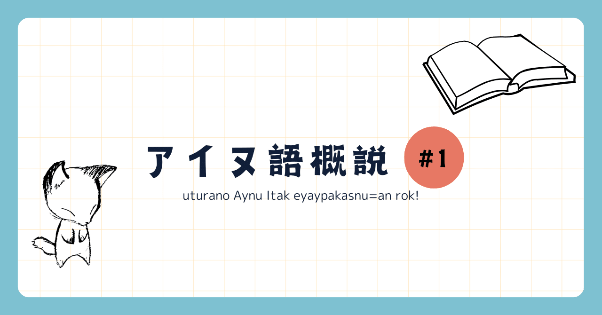

<figure>

</figure>

今回から４回に分けてアイヌ語について大まかに説明していきます。主な種本は佐藤知己(2008)『アイヌ語文法の基礎』、田村すず子(1997)「アイヌ語(言語学大辞典)」、Bugaeva Anna(2014)「北海道南部のアイヌ語」です。他文献については参考文献に記します。  
初回となる今回は、アイヌ語がどんな言語か知っていただくために、基本的な情報について書きたいと思います。

## 系統

現時点で、アイヌ語は系統的に孤立した言語だとされています。語借用関係にある言語は日本語をはじめ複数ありますが、どれについても系統関係を証明するには至っていません。

<figure>

> **借用関係にあると思われる語**  
> アイヌ語 「kamuy」 "神" - 日本語「神」  
> アイヌ語 「tumpu」 "部屋" - 日本語「つぼね」  
> アイヌ語 「casi」 "砦" - 中期朝鮮語「잣/cas」 "城"  
> アイヌ語 「kotan」 "村、集落" - ニヴフ語「xotaN」"町"

</figure>

## 方言

アイヌ語は、東北北部〜北千島にかけて話されていたとされます。しかし、本州で話されていたアイヌ語や北千島で話されていたアイヌ語については、現存する資料が少なく、また再建の試みについても十分に行われていないため、わからないことが多いのが現状です。  
資料が残っているアイヌ語は、北海道方言、樺太方言、千島方言に大別されます(方言の分類の妥当性については議論がありますが、この大きな分類については大体の論文で一致しています)。本概説では、基本的に北海道方言の中の千歳周辺で話されていた方言について説明します。

## 文字表記

アイヌ語の文字による記録は非アイヌ民族によるものが17世紀以降に見られ、また19世紀末よりアイヌ民族自身によるラテン文字、ギリシャ文字を用いた記録が見られます。こんにちアイヌ語の表記法として主に用いられているのはカタカナによるものとラテン文字によるものですが、特に正書法として定まったものはありません。本概説ではラテン文字による表記に統一します。

## アイヌ語の特徴

アイヌ語は、言語類型論による分類ではよく抱合語に分類されます。抱合語とは、**一つの内容語**(学校で「自立語」として習うものとほぼ同じです)**に他の内容語がくっついて文章を作ることができる言語**のことです。また、アイヌ語は膠着語的な特徴も持っていて、**機能語**(付属語とほぼ同じです)**も同様に内容語にくっつく**ことができます(日本語も膠着語に分類されますので、そちらをイメージするとわかりやすいです)。以下の例では、ta "汲む"という動詞がwakka "水"を抱合しています。ku- "私が"も抱合されているのではないか？と思うかもしれませんが、アイヌ語においてku-は自立性の弱い、付属語のようなもの(接辞と呼びます)なので、これは膠着語的な特徴のあらわれです。  
詳しいことは後で見ていくので、ここではアイヌ語は一つの言葉に他の言葉をくっつけることができる、と思っていただければ大丈夫です。

**<例文>**   
ku-wakka-ta  
私が-水-汲む  
"私が水を汲んだ。"

## アイヌ語を学ぶには

ここまで、アイヌ語についてその基本的な情報をまとめました。そこで、興味を持った方向けにアイヌ語を学ぶ方法についていくつかまとめておきたいと思います。

### 大学の授業

北海道、特に札幌周辺の大学や、早稲田大学ではアイヌ語の授業が開講されています。北大では、文学部にて今回の種本の著者でもある佐藤先生の「[アイヌ語の初歩](https://syllabus01.academic.hokudai.ac.jp/Syllabi/Public/Syllabus/SylDetail.aspx?langMode=1)」という授業が開講されています。北大生のかたは是非履修してみてください。

### 教科書・テキスト

アイヌ語の教科書として出版されている書籍は複数ありますが、その中で内容の詳しさと入手の簡単さなどを考え得るとオススメなのは[中川裕(2021)『ニューエクスプレス アイヌ語』](https://www.amazon.co.jp/dp/4560088683/)です。

### インターネット

インターネット上にもアイヌ語の解説記事は多数あります。その中でも正確性が担保されていてわかりやすいのは[STVのアイヌ語ラジオ講座](https://www.stv.jp/radio/ainugo/index.html)、[国立民族学博物館アイヌ語アーカイブ](https://ainugo.nam.go.jp/)(こちらはやや解説が専門的です)などだと思います。私が書く概説の#2以降も参考になる(ネットに上がっている論文以外の文章の中ではかなり詳しくまとまっている)と思います。言語学を学んだことのある方は、田村すず子(1997)「アイヌ語(言語学大辞典第１巻収録)」、Bugaeva Anna(2014)「北海道南部のアイヌ語」あたりを読むと良いと思います。

### 言語学サークル

現在、言語学サークルでは『アイヌ語文法の基礎』を底本としてゼミ形式でアイヌ語を学んでいます。サークルへの入会は[公式X](https://twitter.com/HU_Linguistic)(Twitter)のDMまでお願いします。

## まとめ

アイヌ語概説 #1ということでここまで解説してきましたが、いかがでしたでしょうか？質問等あればサークル[公式X](https://twitter.com/HU_Linguistic)(Twitter)までお願いします。アイヌ語概説 #2では発音アクセントといった音韻、音声の分野についてまとめていきます。ここまで読んでいただきありがとうございました。

## 参考文献

- 佐藤知己(2008)『アイヌ語文法の基礎』. 大学書林
    
- 田村すず子(1997)「アイヌ語」. 亀井孝・河野六郎・千野栄一編『言語学大辞典セレクション 日本列島の言語』. 三省堂
    
- 中川裕(2021)『ニューエクスプレス アイヌ語』.白水社
    
- 中川裕(2003)「日本語とアイヌ語の史的関係」
    
- Bugaeva Anna(2014)「北海道南部のアイヌ語」
    
- 奥聡(2008)「多総合的言語としてのアイヌ語 : 普遍文法理論の視点からの試論」
