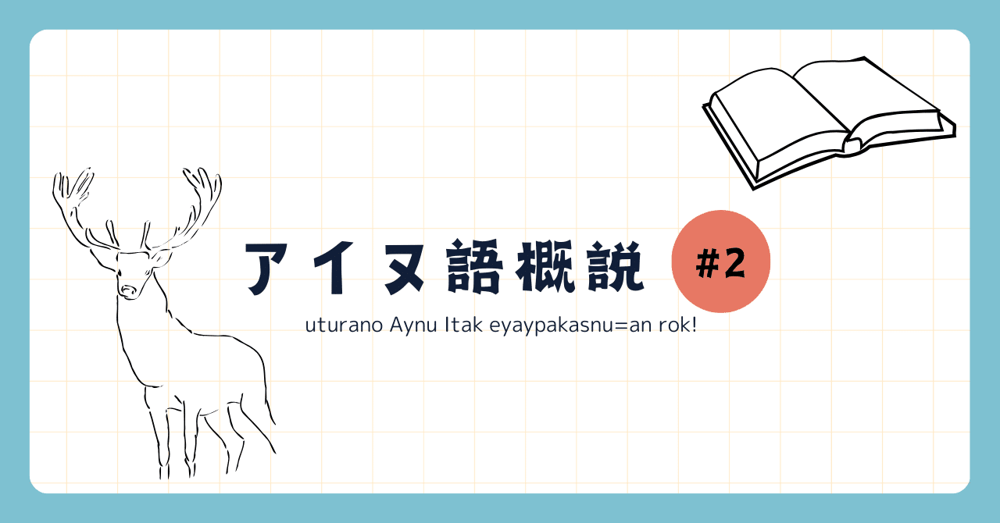

<figure>

</figure>

アイヌ語を4回に分けて解説していく記事の2つ目です。できればアイヌ語概説 [#1](https://note.com/_pccm4/n/nb6fc1700a166)を先にお読みいただいてからこちらを読んでください。#2では発音やアクセントなど音声、音韻論に関わる部分を解説します。

## 表記と発音

ラテン文字表記で用いられる字母とその発音を以下にまとめました(音声は[IPA](https://www.coelang.tufs.ac.jp/ipa/index.php)に準拠しています)。音素としてアイヌ語には12の子音と5の母音があります。

### 字母の一覧とその発音

[https://gist.github.com/ka-snowy/9e25b29d15a44dc63399d035c9b2233b#file-aynuitak\_table1-md](https://gist.github.com/ka-snowy/9e25b29d15a44dc63399d035c9b2233b#file-aynuitak_table1-md)

[https://gist.github.com/ka-snowy/9e25b29d15a44dc63399d035c9b2233b#file-aynuitak\_table2-md](https://gist.github.com/ka-snowy/9e25b29d15a44dc63399d035c9b2233b#file-aynuitak_table2-md)

### 発音の特徴、注意

有声音/無声音、有気音/無気音および短母音/長母音の区別が一般に認められないのが北海道アイヌ語の大きな特徴です¹。また、音節構造はCVとCVCが認められます²。頭子音には全ての子音が立つ可能性がありますが、音節末に立つ子音はp、t、k、s、r、m、n、r、w、yの９つのみです。  
これら音節末の子音のうち、p、t、kは内破音として発音されます。以下に、発音の例を挙げます³。

[https://stand.fm/episodes/65d37aa9d53c8924029b3c7c](https://stand.fm/episodes/65d37aa9d53c8924029b3c7c)

[https://stand.fm/episodes/65d37b97d53c8924029b3c8d](https://stand.fm/episodes/65d37b97d53c8924029b3c8d)

[https://stand.fm/episodes/65d37bd7e951a73cf8f785ed](https://stand.fm/episodes/65d37bd7e951a73cf8f785ed)

またs、rは直前の母音の口のまま発音されることが多いようです。同様に発音の例を挙げますが、例えばmosirのrは\[ɾi\]のように発音します。

[https://stand.fm/episodes/65d37cdce951a73cf8f785f8](https://stand.fm/episodes/65d37cdce951a73cf8f785f8)

[https://stand.fm/episodes/65d37d12d53c8924029b3c97](https://stand.fm/episodes/65d37d12d53c8924029b3c97)

## アクセント

樺太アイヌ語が強弱アクセントであるのに対し、北海道アイヌ語は高低アクセントである、と一般に言われています。アクセント規則については、わかっていないことが多いですが、少なくとも第一アクセントの位置については、多くの場合以下の規則で決まります。

- 語頭が開音節(CV)の場合  
    二音節目に第一アクセントがきます。  
    ko**tan** "村、集落"  
    ka**muy** "神"
    
- 語頭が閉音節(CVC)の場合  
    一音節目に第一アクセントがきます。  
    **ay**nu "人間"  
    **sir**wen "天気が悪い"
    

一方で例外もあり、例えば**re**ra "風"などは開音節で始まるにも関わらず第一アクセントが一音節目にあります。

## まとめ

- アイヌ語には12の子音と5の母音がある
    
- 発音の際は音節末子音に注意(p,t,kは内破音)
    
- 第一アクセントは語頭が開音節か閉音節かで規則的につく
    

質問、サークル入会希望等は、[公式X](https://twitter.com/HU_Linguistic)あるいは著者までお願いします！次回#3はアイヌ語の最も特徴的な部分である語の形態(単語の成り立ち)についてまとめていきます。

## 補足

### 用語の解説

有声音/無声音：声帯の振動を伴うのが有声音、伴わないのが無声音です。日本語ではm/pがそれぞれ有声/無声音に対応します。  
有気音/無気音：気息(息)を伴うのが有気音、伴わないのが無気音です。日本語ではあまり区別されません。中国語のp/bはそれぞれ有気音/無気音です。  
短母音/長母音：伸ばさない音と伸ばす音です。  
内破音：韓国語などでみられます。英語"cup"のpの音を発音する直前で止める(口を開かない)イメージで発音すると発音できます。  
C：consonant(子音)  
V：vowel(母音)  
開音節/閉音節：母音/子音で終わる音節のことです。例えば、yuやaという音節はu、aと母音で終わっているので開音節、kapやsanはp、nと子音で終わっているので閉音節です。

### 注

1\. "北海道"アイヌ語と書いたのは、樺太アイヌ語には長母音、短母音の区別があるからです  
2\. 音節の頭に母音が立つこともあるため、V、VCを認めることもできますし、そのようにする教科書もありますが、実際母音から始まる音節の多くは声門閉鎖音が発音されるため、今回は簡単のために音節構造としてCV、CVCのみを認める立場に立ちます。  
3\. 発音の例として添付したファイルは、自分で録ったものです。音質が悪いしあんまり正確な発音じゃないかもしれないです。

## 参考文献

- 佐藤知己(2008)『アイヌ語文法の基礎』. 大学書林
    
- 田村すず子(1997)「アイヌ語」. 亀井孝・河野六郎・千野栄一編『言語学大辞典セレクション 日本列島の言語』. 三省堂
    
- 中川裕(2021)『ニューエクスプレス アイヌ語』.白水社
    
- Bugaeva Anna(2014)「北海道南部のアイヌ語」
