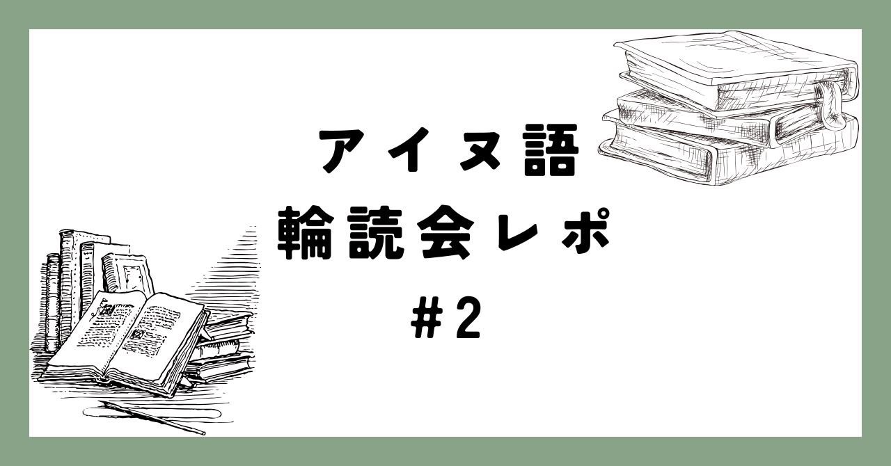

<figure>

</figure>

前回に引き続きアイヌ語の勉強会を行いました。第二回は4〜6課について学習しました。軽い学習内容のまとめと、前回に引き続き気になった内容について取り上げます。

## 学習内容

### 第4課 人称接辞と人称代名詞

- 人称の標示方法：人称代名詞と人称接辞
    
- 4人称について
    
- 主格目的格人称接辞
    

### 第5課 後置詞

- 後置詞を用いた名詞句の作り方
    
- 格助詞と後置副詞の違い
    

### 第6課 接続助詞

- 接続助詞及び類似の形式とその語法
    

## アイヌ語4人称の共時的研究

アイヌ語の教科書の多くは人称体系に「4人称」という用語を登場させます。これは具体的に不定人称(不特定の人を指す人称)や一人称複数包括形(話し相手を含む「私たち」)を指すのですが、これを中心にアイヌ語人称体系の研究について概観しようと思います。

### 〜1970s アイヌ語人称体系の整理

知里(1936)の時代から、アイヌ語の主格接辞a=/=anおよび目的格接辞i=は口語、雅語(口承文芸)の人称のパラダイムの中で複数箇所に登場します。知里(1936)は雅語一人称、口語一人称複数包括形、口語二人称敬称の接辞をa=/=anであるとしました。そして、一人称複数包括形の用法として、不定人称、引用文中の一人称用法を含めました。  
また、a=と=anの使い分けについてはこの頃から一貫して動詞が一項動詞であるか二・三項動詞であるかであるとされています(詳細は当サークル記事のアイヌ語文法概説を参照してください)。  
田村(1971)はa=/=anについて、”接辞そのものが(中略)主語、目的語等の人称に呼応して出て来るものと考えられるので、これらの接辞が同一形式か同音異義形式かを議論することには意味はない”としました。また、雅語の人称パラダイムについても、口承文芸を引用調での語りとし、引用文中の一人称用法に帰着させました。

### Refsing(1986) 静内方言「4人称」の提唱

Refsing(1986)は人称接辞の分類として不定人称"Indefinite Person"という概念を提唱し、その意味を"The basic meaning of the indefinite person has to do with an unknown executor of action … or with people in general"と述べました。そして、a=/=anは意義素として同一であり、母語話者はそれぞれの用法を区別していない、またそれぞれの用法は元のコアとなる意味から導かれるとしました。また、Refsingは受動態についても不定人称がそのマーカーであると指摘しました。

### 田村(1984)、中川(1988) 形態的カテゴリとしての4人称

これを受けて、田村(1984)(Refsingは出版物であるため田村の論文の方が先に世に出ています)も不定人称というカテゴリで接辞a=/=anをまとめました。しかし、田村もa=/=anを意義素として立てているわけではないのではないか、と中川(1987)は指摘し、また中川(1988)は以下の理由から不定人称は少なくとも沙流、千歳方言においては形態的カテゴリとするのが妥当だとしました。  
その理由となるのが、a=が動詞単数形に接続する用例です。a=は単数を指していたとしても基本的には動詞複数形に接続します(おそらく通時的には包括的一人称複数に由来するため)。しかし、沙流方言、千歳方言においては口承文芸中にa=が単数形に接続する例が見られ、単複の別がある以上意義素として同一視する、というよりはあくまで形態的カテゴリとして立てる方が良いだろうと論じました。

### Bugaeva(2014) 現在の4人称の扱い

Bugaeva(2014)は"不定人称は、ひとつの形式で表されるいくつかの機能をまとめたものである。"とまとめました。これは田村(1984)の流れを汲むもので、また教科書の多くも同様のまとめかたをしています(4人称という言葉は教科書でよく用いられます)。

## まとめ

ここまで4人称(不定人称)という人称の提案とその機能についての議論を中心にアイヌ語の人称研究について見てきました。  
人称接辞の通時的変化については中川(1988)などが言及していて、また機会があったらまとめてみようと思います。  
ここまでお読みくださりありがとうございました！  
北大言語学サークルやアイヌ語ゼミに興味がある方はぜひ[公式X](https://twitter.com/HU_Linguistic)までご連絡ください。

## 参考文献

- 中川 裕, 「アイヌ語の人称接辞」, 『国文学解釈と鑑賞 』52巻2号, 1987.
    
- 中川 裕, 「アイヌ語千歳方言の人称代名詞とその歴史的位置」, 『東京大学言語学論集'88』, 1988.
    
- Kirsten Refsing 『The Ainu Language: The Morphology and Syntax of the Shizunai Dialect』,Aarhus University Press, 1986.
    
- 金田一 京助, 知里 真志保, 「アイヌ語法概説」, 『世界言語学名著選集 (第2期(東アジア言語編) 第2巻)』, 1936.
    
- 田村 すず子, 「アイヌ語沙流方言の人称代名詞」, 『言語研究』59巻, 1971.
    
- 田村 すず子, 『AYNU ITAK アイヌ語入門 解説』,早稲田大学言語教育研究所, 1984.
