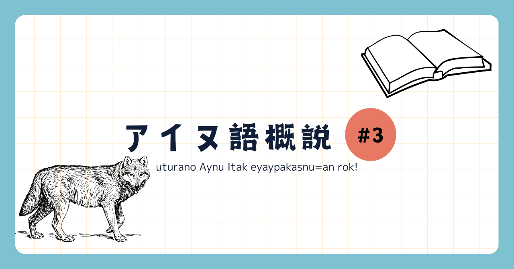
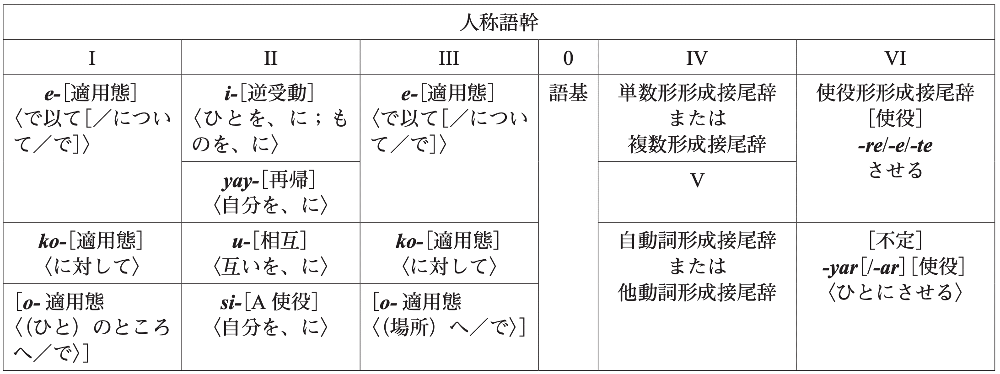

<figure>

</figure>

アイヌ語を4回に分けて解説していく記事の3つ目です。できればアイヌ語概説 [#1](https://note.com/_pccm4/n/nb6fc1700a166#fe4acc22-d1d7-4293-8ad6-4b7bcd0f9f85)、[#2](https://note.com/_pccm4/n/n836cb51b46e5)を先にお読みいただいてからこちらを読んでください。#3では形態論、すなわち個々の単語の構成について見ていきたいと思います。  
さて、#1でも書きましたが、アイヌ語は抱合と膠着を行う言語です。今回はそれぞれどんな要素がどんなルールで抱合され、膠着するのか見ていきます。どうしても専門用語が多くなってしまいますので、適宜記事の終わりにある用語の(大雑把な)解説も参考にしてください。

## 動詞の数

動詞の数、と書いたようにアイヌ語の名詞には基本的に単数形複数形が存在しませんが、動詞には一部単数形と複数形があるものがあります。この単数複数は、原則として、**一項動詞の場合は主語の単数複数と、二項以上の動詞の場合は目的語の単数複数と一致します**(この点においてアイヌ語は非対格的な性質を示します)。しかし、二項以上の動詞でも主語の単複と動詞の単複が一致する場合もあり、さらに動作の回数で複数形になるものもあったりと、例外も多いです。以下に原則と一致するような例文、一致しない例文をそれぞれを示します。  
一つ目は主語(私/私たち)、二つ目では目的語(木)の単複と動詞の単複が一致していて、これは原則通りです。三つ目が例外で、切った回数によって動詞の単数形と複数形を使い分けています。

k-**arpa**. "私は行った。"  
c-**paye**. "私たちは行った。"

<figure>

> (単語とその訳)  
> k- (ku-) "私が"  
> c- (ci-) "私たちが"  
> arpa "行く(単数)"  
> paye "行く(複数)"

</figure>

cikuni ku-**kaye**. "私は木を(一本)折る。"  
cikuni ku-**kaypa**. "私は木を(たくさん)折る。"

<figure>

> cikuni "木"  
> kaye "折る(単数)"  
> kaypa "折る(複数)"

</figure>

cep ku-**tuye**. "私は魚を(一回)切る。"  
cep ku-**tuypa**. "私は魚を(複数回)切る。"

<figure>

> cep "魚"  
> tuye "切る(単数)"  
> tuypa "切る(複数)"

</figure>

## 膠着

### 動詞に膠着する要素

アイヌ語は、主要部標示言語と言って、動詞にさまざまな文法機能(人称、数など)が示される言語です。特に、膠着というのは文法機能を表すものが語につくことですから、この章は基本的に動詞についての話になります。  
動詞に膠着する要素(以下、接辞と呼びます)は、その機能から**人称接辞**、**名詞的接辞**、**充当接頭辞**、**使役接尾辞**に分類することができ、必ず人称接辞が一番外側に付きます。その他の接辞のつく順番には議論がありますが、参考にBugaeva(2014)の表を示します。

<figure>

</figure>

この表で\UTF{2160}、\UTF{2162}で適用態としてまとめられているのが充当接頭辞、\UTF{2161}にあるのが名詞的接頭辞、\UTF{2165}が指すのが使役接尾辞です。\UTF{2163}、\UTF{2164}については不規則な形が多く複雑ですので本概説では詳述しません。また、抱合が起こる際抱合される語は\UTF{2160}あるいは\UTF{2162}の前に付きます。

### 人称

人称代名詞は、認められてはいるが用例が少なく、強調したい時以外は基本的に省略されるようです。むしろ、一般の文章において人称は動詞につく人称接辞によって表されます。**人称接辞は主格、目的格、主格目的格の3種類があり**、千歳方言では下表の通りです。

[https://gist.github.com/ka-snowy/9e25b29d15a44dc63399d035c9b2233b#file-aynuitak\_table3-md](https://gist.github.com/ka-snowy/9e25b29d15a44dc63399d035c9b2233b#file-aynuitak_table3-md)

[https://gist.github.com/ka-snowy/9e25b29d15a44dc63399d035c9b2233b#file-aynuitak\_table5-md](https://gist.github.com/ka-snowy/9e25b29d15a44dc63399d035c9b2233b#file-aynuitak_table5-md)

アイヌ語の人称に関する特徴として、四人称の存在が挙げられます。四人称には、不定人称用法（不特定の人間を主語/目的語に置くときに用いる）、包括的一人称複数用法、二人称敬称用法、引用文中の一人称用法、そして叙述者用法（kamuy yukar = アイヌの神謡で用いられる）の5つの用法があります。下に例文を示します。本来、三人称は文脈によって彼、彼女、これ(特定のもの)のいずれも指すことができますが、今回は一旦適当に訳しています。

e.\UTF{00A0} "彼は これを 食べた。"  
k-e.\UTF{00A0} "私は これを 食べた。"  
en-e.\UTF{00A0} "これは 私を 食べた。"  
eci-e. "私は あなたを 食べた。"

<figure>

> e "食べる"

</figure>

### 名詞的接辞

アイヌ語の名詞的接頭辞として挙げられるのは、以下の四つです\UTF{00B9}。例文を下に示しますが、例えばukasuy "助け合う"はu- "互いを"がkasuy "助ける"に膠着するという成り立ちをしています。yay-とsi-の使い分けについては議論がありますが、ここでは一旦田村(1997)に従います。

[https://gist.github.com/ka-snowy/9e25b29d15a44dc63399d035c9b2233b#file-aynuitak\_table6-md](https://gist.github.com/ka-snowy/9e25b29d15a44dc63399d035c9b2233b#file-aynuitak_table6-md)

**u**\-kasuy "助け合う "  
**yay**\-kopuntek "自分自身のことを喜ぶ/褒める"  
**si**\-y-etok\UTF{00B2} "自分の前方"  
**i**\-ku "酒を飲む"

<figure>

> kasuy "〜を助ける"  
> kopuntek "〜のことを喜ぶ/褒める"  
> etok "〜の前方"  
> ku "\UTF{FF5E}を飲む"

</figure>

### 充当接頭辞

充当接頭辞とは、適用態とも呼ばれ、動詞のとる項数を増やすような接辞のことです。アイヌ語には以下の3つが存在しています。

[https://gist.github.com/ka-snowy/9e25b29d15a44dc63399d035c9b2233b#file-aynuitak\_table7-md](https://gist.github.com/ka-snowy/9e25b29d15a44dc63399d035c9b2233b#file-aynuitak_table7-md)

**e**\-kira "〜と逃げる"  
**o**\-ahun "〜に入る"  
**ko**\-sakayokar "\UTF{FF5E}を怒鳴りつける"

<figure>

> kira "逃げる"  
> ahun "入る"  
> sakayokar "怒鳴る"

</figure>

充当接頭辞がどのようなものか理解するために、一つ目の動詞ekiraについて見ていきます。まず、kira "逃げる"を使った文書が以下です。

kani ku-kira. "私は逃げた。"

<figure>

> kani 私(人称代名詞)  
> ku- 私は(人称接辞)

</figure>

続いて、充当接頭辞e-をつけると、

kani pon menoko ku-e-kira. "少女を連れて(=少女と一緒に)私は逃げた"

<figure>

> pon menoko "少女"

</figure>

というふうに、**動詞が取れる項の数が増えていて、その項の文の中での機能(格)はどんな充当接頭辞か(今回はe-)によって決定づけられています**。

以上に例を示しましたが、実際には、充当接頭辞が示す格はさまざまであり、より抽象的な意味を持つとされています。また、田村(1997)にはo-は口語では少数の決まった語以外では滅多に見られない、などといった指摘もあります。

### 使役接尾辞

アイヌ語には-reという使役接尾辞があります。

hosipi-**re**\UTF{00A0}"帰す"

<figure>

> hosipi "戻る"

</figure>

## 抱合

アイヌ語の抱合現象は、大きく重複、合成の二つに分類できます。

### 重複

アイヌ語では、一つの動詞の語根を繰り返すことで、その動作が何度も繰り返されることを表現できます(畳語をイメージすると理解しやすいかもしれないです)。

tuypatuypa "何回も切る"

<figure>

> tuypa "切る"

</figure>

### 合成

アイヌ語は、二つ以上の独立した語を組み合わせて新しい語を作ることができます。合成によって作られる動詞、名詞について以下に一つずつ例を示します。

sikkes "目尻"  
wakkata "水汲みをする"

<figure>

> sik "目"  
> kes "端"  
> wakka "水"  
> ta "採ってくる"

</figure>

特に、合成動詞について、抱合が起こると、**動詞が取れる項の数が変化することがあります**。例えば、上に挙げた例のta/wakkataを用いて説明すると、これら2つの動詞は以下のように用いられます。

pukusa ku-**ta**. "私はギョウジャニンニクを採った。"  
ku-**wakkata**. "私は水汲みをした。"

<figure>

> pukusa "ギョウジャニンニク"  
> ku- 一人称単数主格接辞 "私は"  
> wakka "水"  
> ta "採ってくる"

</figure>

以上の例を見るとわかるように、taは動作主と対象を項として必要とするのに対して、wakkataは対象であるwakkaが動詞に抱合されたため動作主のみを必要とします。つまり、**taは２項動詞であるのに対し、wakkataは１項動詞になります**。ここで、合成動詞に抱合される動詞以外の要素について意味役割の観点から分類すると以下のようになります。

1. \UTF{00A0}1項動詞の動作主にあたる名詞の抱合
    
2. 2、3項動詞の動作主にあたる名詞の抱合
    
3. \UTF{00A0}2、3項動詞のの被動者、対象にあたる名詞の抱合
    
4. \UTF{00A0}充当接頭辞を用いた道具、場所などの抱合
    

アイヌ語では、基本的には動作主は主格接辞で表示され、被動者は目的格接辞で表示されるというように対応していますが、上記の３の例においてはその対応が崩れる例が見られます。以下に例を示します。

”波が私をころばせる”  
rir en-turese\UTF{00A0}**  
ku-**rir-tursere\UTF{00A0}  
\***en-**rir-rayke(正しくない文章)

<figure>

> rir "波"  
> turese "転ばせる"

</figure>

動詞tureseにrirが抱合された際、元の文章で被動者であるため目的格であった「私」は、主格で示されます。これは、アイヌ語の1項動詞は主格接辞をとるという規則が意味役割と格の対応に優先された例であると考えられます。このような現象を、「昇格」といいます。

## まとめ

- 動詞には、人称接辞、名詞的接辞、充当接頭辞、使役接尾辞が膠着しうる。人称接辞はその中で一番外側につく。
    
- アイヌ語は人称接辞がメインで人称を示している。人称代名詞はあまり使われない。
    
- 動詞の抱合現象は重複と合成に分類される。
    

今回はかなり内容が多く、また充当接頭辞など難しい内容を含んでいましたので、一回読んで分からなくても大丈夫です。実際のアイヌ語の文章や他教科書などを読んでいく中で理解していきましょう。  
次回は語を並べる規則である統語について見ていきます。質問、サークル入会希望等は、[公式X](https://twitter.com/HU_Linguistic)あるいは著者までお願いします。

## 補足

### 用語の解説

抱合：単語(主に動詞)に他の意味的な単位(名詞や副詞)を合体させて新たな単語(動詞)を形成すること。  
膠着：単語に他の機能的な単位(機能語に当たるもの)がついて単語の文章内での機能を示すこと。  
n項動詞：動詞の意味を成立させる上で必要な要素の個数から動詞を分類したときの呼び方。日本語で言えば例えば動詞「歩く」は主語のみを必要とするため一項動詞に、「食べる」は主語のほかに目的語を必要とするため二項動詞に分類されます。  
包括的一人称複数：話の相手を含んだ「私たち」  
除外的一人称複数：話の相手を含まない「私たち」  
意味役割：動詞と項(大まかに主語や述語のことだと思ってもらって良いです)の意味上の関係に基づく項の分類のことです。例えば、動作主、被動者、着点などのように分類されます。

### 注

1. yay-とsi-の使い分けについて、金田一（1960）ではyay-に意思の介在があり、si-は無意志的であるとされており、これは田村（1997）などでも同様です。これについては他にも様々な説が提唱されていますが、いずれにおいても、si-はyay-と比較すると狭い意味を持つ接頭辞であるとされています。  
2. si-y-etokについて、si-とetokの間に入っているyは挿入子音と呼ばれ、アイヌ語の音韻規則で許されない母音連続が起こった際に挿入されます。

## \UTF{00A0}参考文献

- 佐藤知己(2008)『アイヌ語文法の基礎』. 大学書林
    
- 田村すず子(1997)「アイヌ語」. 亀井孝・河野六郎・千野栄一編『言語学大辞典セレクション 日本列島の言語』. 三省堂
    
- 中川裕(2021)『ニューエクスプレス アイヌ語』.白水社
    
- Bugaeva Anna(2014)「北海道南部のアイヌ語」
    
- 小林美紀(2010) 「アイヌ語の動詞接頭辞 si- と yay- の項同定機能」『千葉大学人文社会科学研究(第21号)』
    
- 佐藤知己(2007)「アイヌ語千歳方言の再帰接頭辞yay-とsi-について」『認知科学研究(第５巻)』
    

  

###
