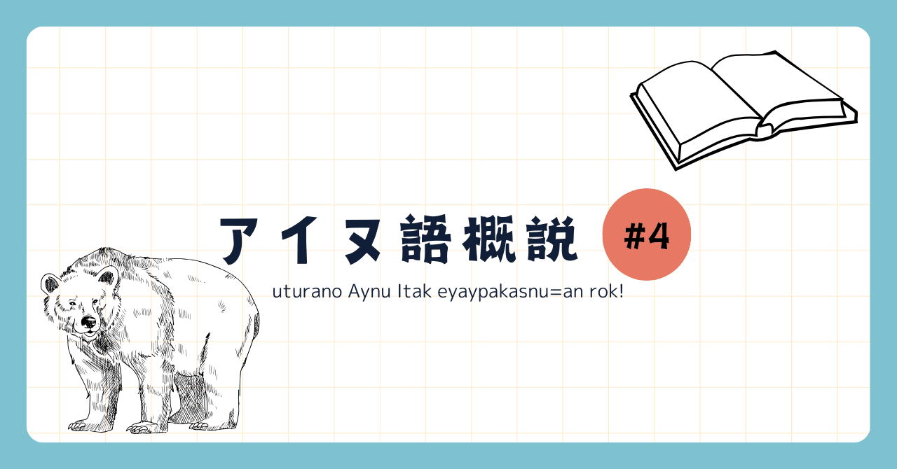

<figure>

</figure>

アイヌ語を４回に分けて解説する記事の４本目です。できれば[#1](https://note.com/_pccm4/n/nb6fc1700a166#fe4acc22-d1d7-4293-8ad6-4b7bcd0f9f85)、[#2](https://note.com/_pccm4/n/n836cb51b46e5)、[#3](https://note.com/_pccm4/n/n7ec20f7c0e15)を先にお読みください。#4では文の成り立ち、統語論について見ていきます。まず品詞分類やTMAなど文法カテゴリについて、続いて節や句の構造について説明します。

## 文法カテゴリ

### 品詞分類

アイヌ語の単語は、動詞、名詞、連体詞、副詞、助詞、間投詞に分類されます。 日本語と比較すると、大きな違いの一つは形容詞が存在しないことでしょう。アイヌ語では、日本語でいう形容詞に相当するものは動詞に含まれており、動詞と文法的に全く同じ振る舞いをする他、動詞的な意味も表します。例えばpirka「良い」は「良い」という意味だけでなく、「良くなる」という意味でも使われます。

### 格

主格、目的格の基本的な格は語順によって示され、斜格を示す形式には後置詞と充当接頭辞があります。下の一つ目の例のwaが後置詞にあたり、名詞の後に続いてその名詞の格を標示します。二つ目の例は充当接頭辞を用いる格の標示方法で、充当接頭辞o-"〜に"を用いるとahun"入る"はpon cise or"小屋"を目的語と同様の扱いで取れるようになります(#3も参照)。

tokiyo **wa** k-ek. "私は東京から来た。"  
pon cise or **o-**ahun. "小屋に入りなさい。"

<figure>

> tokiyo "東京"  
> wa 起点"〜から"  
> k- 一人称単数主格接辞  
> ek "来る"  
> pon cise "小さい家、小屋"  
> or "〜のところ"  
> o- 充当接頭辞"〜に"  
> ahun "入る"

</figure>

ところで、後置詞について、後置詞は格助詞と後置副詞の2種類に分かれ、自立性、取りうる名詞などに違いがあります。下の例ではunが格助詞、eunが後置副詞ですが¹、unは位置名詞という位置を表す特定の名詞しか取ることができません。そのため、tokuy un…という表現は正しくなく、tokuy or"友達のところ"とする必要があります。また、上の例でいうとTokiyo"東京"は位置名詞であるため、格助詞waで格を標示することができます。

例文 "私は友達のところに行った。"  
tokuy **eun** k-arpa.   
\*tokuy un k-arpa.  
tokuy or **un** k-arpa.

<figure>

> tokuy "友達"  
> eun 後置副詞"〜へ"  
> un 格助詞"〜へ"  
> k- 一人称単数主格接辞 "私は"  
> arpa "行く"  
> or "〜のところ"

</figure>

### 時制、相、法

時制に関する表現は基本的に存在せず、同一の文章で過去、現在、未来のいずれも表すことができます。一方、相、法は基本的に助動詞を用いて表示されます。下の例のk-e aやk-e kusu neのように、助動詞は動詞の後につきます。

cep k-e **a**. "私は魚を食べた"(「のでもう食事は済んでいる」のように完了の意味を含む。)  
cep k-e **kusu** **ne**. "私は魚を食べるつもりだ。"

<figure>

> cep "魚(多くの場合サケを指す)"  
> k- 一人称単数主格接辞  
> e "食べる"  
> a 完了の助動詞  
> kusu ne 意志の助動詞

</figure>

### 受動態と能動態

アイヌ語は少し特殊な方法で受動文を作ります。  
アイヌ語で受動文を作る時は、主格接辞を不定人称接辞にし、目的格接辞に動作の対象をおきます。四人称の不定人称用法をもって、能動文の語順のまま受動文を作ることができます。  
次の文を例にして見ていきましょう。

kimunkamuy aynu rayke. "クマが人を殺す。"

<figure>

> kimunkamuy "熊"  
> aynu "人"  
> rayke "殺す"

</figure>

これを先の規則に従って受動文にしようとすると、

aynu **a-rayke**. "人が殺される。(=誰かが人を殺す)"

というふうになります。raykeは四人称主格、三人称目的格(「人」)を示すため接辞a-がつきます。しかし、これでは誰に人が殺されたのかわかりませんので、元の文章を受動態にするには斜格句によって修飾する必要があるわけです。すなわち、完全に対応する受動文は以下のようになります。

aynu **kimunkamuy or wa** a-rayke. "人がクマに殺される。"

<figure>

> kimunkamuy or wa "クマによって"

</figure>

## 節/句の構造

### 平叙文の構造

・V  
・S+V  
・A+O+V  
・A+IO+DO+V  
・S+C+Vc  
IO、DOは関節、直接目的語を指します。Vcはコピュラを指し、アイヌ語ではneがあたります。また、動詞以外の語順については厳しい制約というわけではなく、入れ替わることもあるようです。

### 名詞句の構造

基本的に修飾語/句-被修飾語/句の順番です。修飾語/句に立ちうるものとしては、以下の様なものがあります。  
・数量詞(sine "一つの"など)  
・指示詞(toan "あの"など)  
・副詞  
・名詞(句)  
・関係節

特に関係節について、関係節を作る方法は大きく二つに分かれます。  
まず一つ目は、主要部(被修飾語にあたる部分)をギャップ(空白)にして作る方法です。以下の例を見るとわかるように、utar "人々"の部分が空白になってできた関係節\[cise soy pakno arki\]がutarを修飾しています。

\[cise soy pakno arki\] utar anak… "家の前まできた人々は…"  
cise soy pakno utar arki. "家の前まで人々が来る"

<figure>

> cise "家"  
> soy "外"  
> pakno "まで"  
> arki "来る"  
> utar "人々"  
> anak "〜は(主題化)"

</figure>

この方法を用いて関係節化できるのは動詞が取る項であるため、斜格名詞(句)を関係節化することはそのままではできません。しかし、充当接頭辞を用いて斜格を動詞の項にしてやることで上と同様の方法で関係節化することができます。下の例では、a-e-hotkeがusiを関係節として修飾しています。

katkemat \[a-e-hotke\] usi kar. "婦人は私に寝る場所を作った。"  
\*usi a-e-hotke. "場所で私は横たわる。"(本来はusiを修飾して「〜な場所」のようにする必要がある)

<figure>

> katkemat "婦人"  
> a- 一人称単数主格接辞(雅語からの用例のためku-ではない)  
> e- 充当接頭辞"〜で"  
> hotke "寝る、横たわる"  
> usi "場所"  
> kar "作る"

</figure>

二つ目は、格助詞、後置副詞を用いた標示です。斜格を充当接頭辞を用いずに関係節化する方法になります。teppoが元の文章の中でどんな格にあたるものであったかを示すためにaniが関係節の頭に立ちます。

\[**ani** ku-yupo kamuy tukan\] teppo "私の兄がクマを撃った鉄砲"  
teppo ani ku-yupo kamuy tukan. "私の兄がクマを鉄砲で撃った。"

<figure>

> ani 具格、共格"〜で"  
> ku- 一人称単数主格接辞  
> yupo "兄"  
> kamuy "クマ(クマはkimunkamuyというが、単にkamuyでクマを指すこともある)"  
> tukan "撃つ"  
> teppo "鉄砲"

</figure>

## まとめ

- 日本語における形容詞は、アイヌ語では動詞に分類される。
    
- 格は多くの場合語順であるいは動詞に示されるが、一部の斜格は名詞の後につく後置詞で示される。
    
- アイヌ語には時制的な表現はない。
    
- アイヌ語の法、相は助動詞を用いて表される。
    
- 受動文は四人称を用いて作ることができる。
    
- 語順はSOV、修飾-被修飾
    

## 補足

### 用語の解説

[こちらのnoteの記事](https://note.com/huling/n/nf91fa59c260b)も参照してください。  
コピュラ：主語＝述語であるような文で、主語と述語を結ぶ言葉のこと。英語で言ったらbe動詞、中国語で言ったら是。  
指示詞：何かを指示する語。日本語ではこそあど。  
関係節：名詞を修飾する節のなかで、被修飾名詞が修飾する節の主語/述語/修飾語のいずれかであるもの。  
斜格：主格、目的格以外の格のこと。

### 注

1 今回は格助詞と後置副詞にほぼ同じ意味のものがある例を選びましたが、格助詞と後置副詞は必ずしも１対１対応するものではなく、格助詞のみ、後置副詞のみに存在する形式が大半です。
