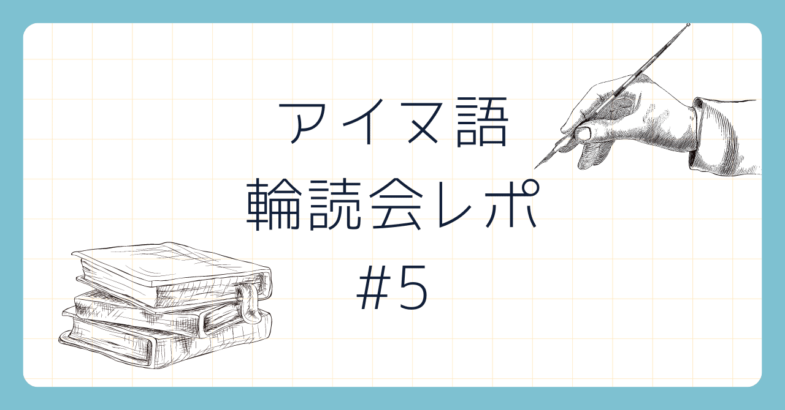

<figure>

</figure>

こんにちは、北大言語学サークルの麩菓子です。  
アイヌ語輪読会の第５回ということで、今回は「アイヌ語文法の基礎」第13〜15課について扱いました。

## 学習レポ

### 第13課 単複の区別のある自動詞の主格人称変化

アイヌ語は義務的につく人称接辞の他に動詞語幹の変化(これも接辞として分析できますが)によって単数複数を標示することがあります。その際の動詞の形態についてまとめました。

### 第14課 目的格人称接辞

目的格を示す人称接辞について学びました。また、他動詞の単数複数は目的語の単数複数と対応する場合が多いため、動詞の形態の変化が若干複雑になる点、目的格は対格である場合と与格である場合がある点に留意するとの記述がありました。

### 第15課 否定文

アイヌ語の否定の形式と否定文の作り方について学びました。  
また、輪読会ではより詳しく否定の形式について概観し、否定のスコープについてどのような研究がなされているか学びました。

## 課外学習：否定関連の諸形式と否定の作用領域

### 否定の諸形式

ヌルミ(2023)を参考に、代表的な否定関連の形式をまとめると、以下のようになります。

1. 文否定
    
    1. 標準的否定
        
    2. 否定的命令
        
    3. 接続表現
        
    4. 節の追加による文否定
        
    5. 従属節の否定
        
    6. 否定動詞
        
2. 非文否定
    
    1. 否定的回答
        
    2. 否定の接尾辞
        

具体的な例が以下です(用例はヌルミ(2023)およびアイヌ語アーカイブより引用、英訳は筆者によるものです)。

1.1. tapan pe seta somo ne. “this is not a dog.”  
1.2. iteki ye. “do not speak.”  
1.3. ku-saware wa somo ku-hopuni. “Since I am lazy I did not get up.”  
       somo ipe somo wakka ku no an. “(She) neither eats or drinks.”  
1.4. k-arpa ka somo ki kusu ne wa. “I will not go.”  
       na epuyke hecirasa ka somo ki. “The flower has not bloomed yet.”  
1.5. 他参照  
1.6. yuk kam isam. “There is no vension.”(yuk kam an. "There is vension.")  
2.1. 省略  
2.2. hankeko “distant” < hanke “close”

否定的回答や命令に関しては後の課に詳しい記述があるので今回は詳しい言及を差し控えますが、否定の形式について以上をまとめると、

- 基本的にはVPを否定する際はsomo VPあるいはVP (ka) somo kiという形式を用いる
    
- 否定命令はitekiを用いる
    
- 意志などのモダリティ表現は否定形式の外側に来る
    
- 一部、動詞について否定の意味を含むものがあったり接辞で否定を表すこともある
    

### 否定の作用領域

- **somo sitoma** no tura sinot.
    
- yaywennukar pe a-ne siri e-nukar kor e-an yakka **iteki sine ka i-erampokiwen sekor hene e-yaynu wa e-itak na. e-hawekor na.**
    
- **itekke toranne** yuptek.
    

以上の３文は、すべて否定あるいは禁止に関連する表現です。太字は否定がかかっている部分で、itekkeは否定命令の形式itekiの異形態です。和訳を以下に示します。

- 怖がらずに一緒に遊んだ。
    
- 苦しんでいる様子をあなたは見たのですが決して一言でも（私を）かわいそうにとでも思って声に出してはなりません。
    
- 決して怠けるな。働きなさい。
    

これら３文の比較からもわかるように、否定の作用領域は基本的にsomoとnoに規定されていると仮定できます(ヌルミ(2024)も同様に述べています)。また、３文目はその原則に反しますが、これについてヌルミ(2024)は以下のように分析します。

<figure>

> 音声的には toranne と yuptek の間に短いポーズがあり、yuptek がやや強調的に発せられるため、2 つの別の文として分析できる

<figcaption>

ヌルミ 2024: 84

</figcaption>

</figure>

つまり、noのような接続詞を伴わない２文の接続が行われている、ということです。このような例以外では、noを伴わない限り基本的に文が途切れるまで否定の作用領域は続きます。

## まとめ

今回は、人称接辞と否定文について学びました。特に否定の作用領域については自分でアイヌ語の作文をする際に気になったので詳しく学びました。他の否定形式についての検討も同論文ではなされているので、今後詳しく読んでみたいと思います。  
最後までお読みいただきありがとうございました。質問やサークル加入希望などお問合せはサークル公式X(旧twitter)までお願いします。

## 参考文献

- 佐藤知己,『アイヌ語文法の基礎』,大学書林, 2008.
    
- ヌルミユッシ,  「アイヌ語の否定表現: 類型論的観点から」, アイヌ・先住民研究 3, 2023: 83-115.
    
- ヌルミユッシ, 「アイヌ語の禁止の副詞の用法について」, アイヌ・先住民研究 4, 2024: 59-92.
